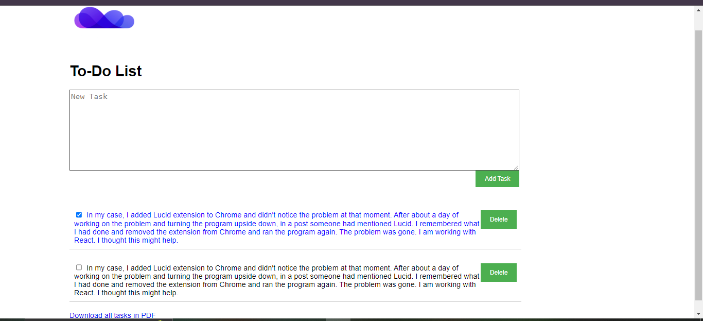

# To-Do App

TaskList is a simple React application that allows you to manage tasks with basic CRUD operations (Create, Read, Update, Delete) and download selected tasks as a PDF.



## Features

- Add new tasks.
- Toggle task completion status.
- Delete tasks.
- Download selected tasks as a PDF.

## Technologies Used

- React: Frontend library for building user interfaces.
- @react-pdf/renderer: Library for generating PDF documents in React.
- Axios: Promise-based HTTP client for making API requests.
- CSS (Cascading Style Sheets): Styling for the UI components.

## Prerequisites

Before running the application, ensure you have the following installed:

- Node.js & npm (Node Package Manager)
- Git

## Installation

1. Clone the repository:

   ```bash
   git clone <repository_url>
   cd TaskList
   npm install
   npm start


### Todo List API

Here's the corrected README.md file for the Todo List API backend:

```markdown
# Todo List API

Todo List API is a backend service built with Node.js, Express.js, and MongoDB for managing tasks with basic CRUD operations (Create, Read, Update, Delete).

## Technologies Used

- **Node.js**: JavaScript runtime environment.
- **Express.js**: Web framework for Node.js.
- **MongoDB**: NoSQL database for storing tasks.
- **Mongoose**: MongoDB object modeling tool for Node.js.
- **cors**: Express middleware for handling Cross-Origin Resource Sharing (CORS).
- **dotenv**: Module for loading environment variables from a .env file.

## Prerequisites

Before running the application, ensure you have the following installed:

- Node.js & npm (Node Package Manager)
- MongoDB server running locally or accessible via URI
- Git (optional, for cloning the repository)

## Installation

1. Clone the repository:

   ```bash
   git clone <repository_url>
   cd Todo-List-API


